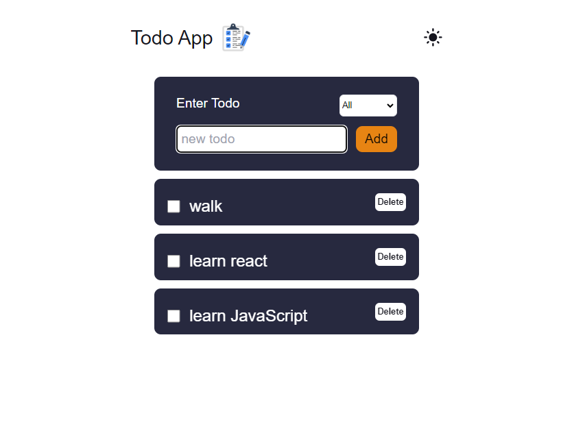
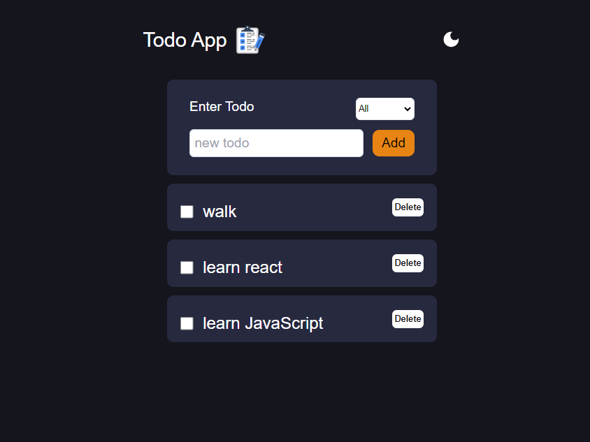
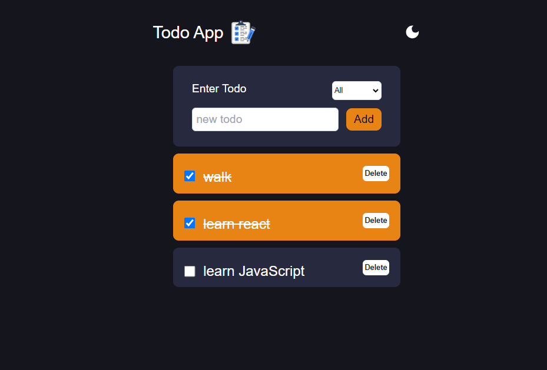

# Todo App

## Table of Content

 * [Overview of the Project](#overview-of-the-project)
 *  [Technologies I Used](#technologies-i-used)
 * [Screenshot](#screenshot)
 
 
# Overview of the Project

A Todo Application made with React + TypeScript and for styling Tailwind CSS is used. This Application consist of 
* Adding todos.
* Deleting todos.
* Checking completed todos.
*  Filtering todos based on if they are completed or Active.
*  A dark theme mode.

## Technologies I Used

* React
* TypeScript
* Tailwind CSS

## Screenshot

     
     

